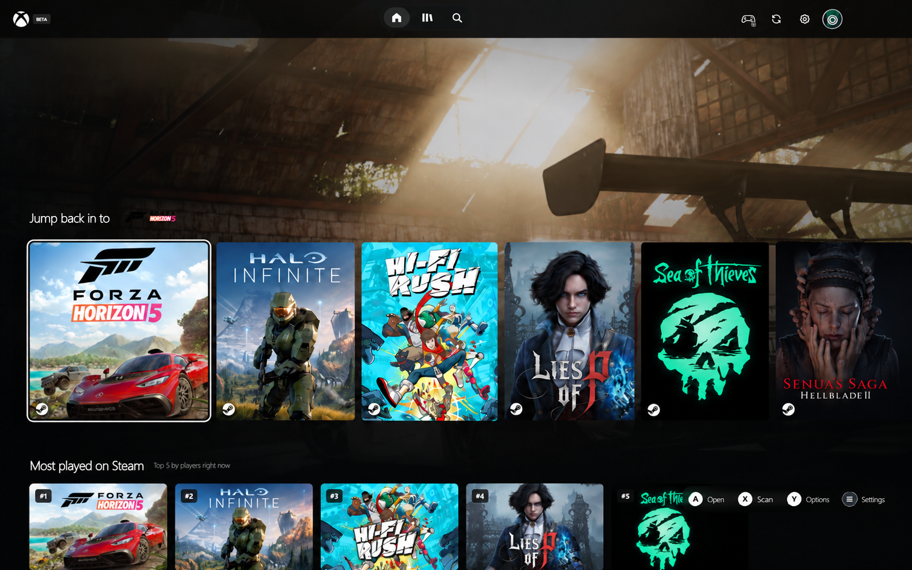
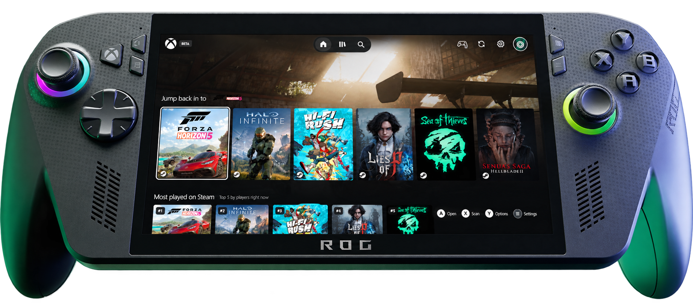
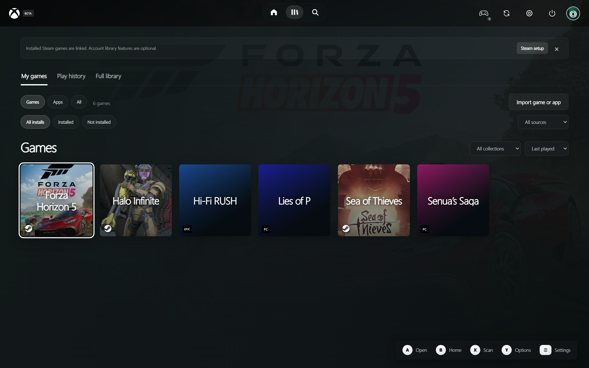
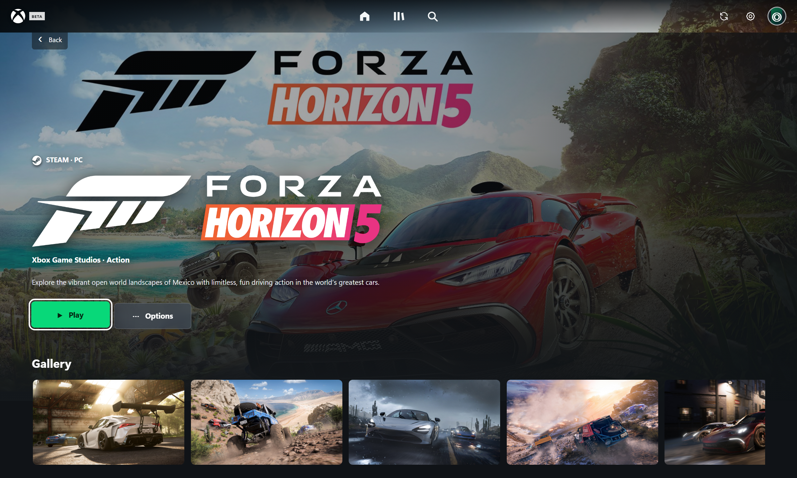

# Xbox Preview UI

An unofficial, controller-first launcher for your Windows games. It brings a console-style Home screen, a proper game library, and artwork-led game pages to the PC you already use.

> **Community beta · 0.25.0-beta.2.** A purely fan-made project, not an official Xbox app or a Microsoft product. It is not affiliated with Microsoft, Sony, Valve, ASUS, or any game publisher.



*Promotional mockup using a sample library; the covers shown are not bundled with the app.*



*Handheld composite based on a supplied device image. It is not a photograph of a physical-device test.*

## What it does

- Finds installed Steam games and supported PC launchers, and lets you add an executable or scan a folder yourself.
- Keeps Steam tools and other software in **Apps**, away from the Home game's shelf.
- Opens a game page before launch, with screenshots, available store details, achievements, and DLC information where supported.
- Works with an Xbox-compatible controller, including an on-screen keyboard, or with a mouse and keyboard.
- Finds square covers from PlayStation, Xbox, IGN, then SteamGridDB. You can replace the cover, backdrop, wide art, or logo yourself.
- Saves fetched covers, logos, backdrops, and viewed game screenshots in a bounded local cache for quicker and more reliable offline return visits.
- Shows Steam news for the selected game inside the launcher. News cards open an in-app preview.
- Home includes recently played games, Steam's top-five player chart, paid top sellers, popular upcoming paid games, and library categories. Chart games can be previewed even when you do not own them. The most-played row shows current player counts for owned and unowned games alike.
- Can shuffle a game’s store screenshots into its detail-page backdrop, with a setting to turn that on or off.
- Offers live interface scaling, tile-corner choices, reduced motion, and optional UI sounds.
- Can be launched as an Xbox Full Screen Experience Home app through a compatible bridge; see [Xbox Mode setup](docs/xbox-mode.md).

| Library | Game page |
| --- | --- |
|  |  |

The screenshots use a sample library; no personal account or installed-game list is included. The library and game-page captures below are from an earlier beta layout.

## Try it

Use the Windows installer for a regular app installation, or the portable EXE if you prefer to replace one file for each update. You can also run it from source with Node.js 20+:

```powershell
npm install
npm start
```

The portable build does not need installation for each update. Replace the old `.exe` with the new one; local settings stay in Windows app data. An installed copy can be selected as a custom executable in a compatible FSE bridge; see [Xbox Mode setup](docs/xbox-mode.md).

After the first import, Home opens from a saved library snapshot. A small progress indicator shows the background refresh. Fetched game artwork is saved locally, subject to a 600 MB cache limit and provider availability; it does not include the games themselves.

On first launch, choose a profile and connect your libraries. Setup now offers an optional SteamGridDB artwork key field and a direct link to its API preferences. The app scans locally installed games. For **uninstalled Steam games** and personal playtime, add your own Steam Web API key during setup or later in Settings → Library, make your Steam profile's game details visible to that API key, and enable the uninstalled-games option. A SteamID64 is usually detected from the signed-in desktop client; it is an identifier, not a login.

SteamGridDB artwork is optional. Add your own SteamGridDB API key in Settings → Library → Artwork & achievement services for community artwork. The release contains no shared SteamGridDB key. Existing private-preview users retain keys already saved locally until they remove or reset them.

For **uninstalled Epic games**, Settings → Library can use a separately installed and signed-in Legendary helper, including supported Heroic installations. Choose `legendary.exe` if it is not found automatically, then enable the Epic uninstalled-games option and scan again. Installing a game opens the Epic Games Launcher. Other stores currently import installed games only.

You can choose **Settings → Clear chosen artwork** to remove manual art selections, or **Reset all launcher data** to return the launcher to its first-run state. Both ask for confirmation. Neither deletes installed games.

## Controller controls

| Input | Action |
| --- | --- |
| D-pad / left stick | Move focus |
| A | Open a game; play on its detail page |
| B | Back; from Library, return Home |
| X | Rescan library |
| Y | Game options |
| Menu | Settings |
| View | Navigation menu |

## What to expect in this preview

- Steam, Epic, Xbox PC, and other launcher discovery is based on local manifests, installed-game folders, or shortcuts. It is **not** account sync for every store.
- Uninstalled Steam games, personal playtime, and personal Steam achievement progress depend on Steam's API and your account visibility. Some titles cannot be returned by the API.
- For a non-Steam game, a matching Steam achievement catalog may be shown **for reference only**. It does not represent your unlocks. An optional OpenXBL key can retrieve achievements for matching games in your Xbox account; availability depends on the service and title match.
- If there is no Steam achievement catalog, the game page offers a search on TrueAchievements. This opens their site for reference; it does not import their artwork or sync your progress.
- SteamDB does not provide an API or permit automated scraping. Imported games use a matching Steam Store listing for screenshots and details when available, or you can enter a Steam App ID in Game options. Xbox catalog details are a fallback.
- Artwork and metadata lookups use unofficial public endpoints. A provider may rate-limit requests, change its pages, or lack a match. Missing covers show the full game title until art is found.
- Steam itself may display a launch notification. The launcher asks Steam to start quietly but cannot guarantee that Steam's own popup is suppressed.
- Artwork caching is best-effort: titles without a match or images blocked by a provider still need a connection or a manual artwork choice.

## Build

```powershell
npm run dist:portable
npm run dist
```

Both artifacts are written to `dist/`. The installer does not silently change Windows' FSE Home app, install a certificate, or register the launcher in the Home-app dropdown. See the separate [FSE setup guide](docs/xbox-mode.md).

## Legal and attribution

This is a purely fan-made, unofficial launcher. Xbox, Xbox Game Pass, Microsoft, PlayStation, Steam, SteamGridDB, ASUS, game names, logos, and artwork belong to their respective owners. Nothing here implies their sponsorship, approval, or affiliation. The app does not bundle games, grant licenses, bypass DRM, or provide content you do not own. Artwork, news, screenshots, achievements, and metadata remain subject to their source services' rights and terms.

**Branding caution:** [Microsoft's published app-branding guidelines](https://www.microsoft.com/en-us/legal/intellectualproperty/trademarks) restrict unlicensed use of its names and logos in app names, icons, and promotional material. This fan disclaimer does not grant permission. The project may need rebranding or asset changes if requested by a rights holder.
